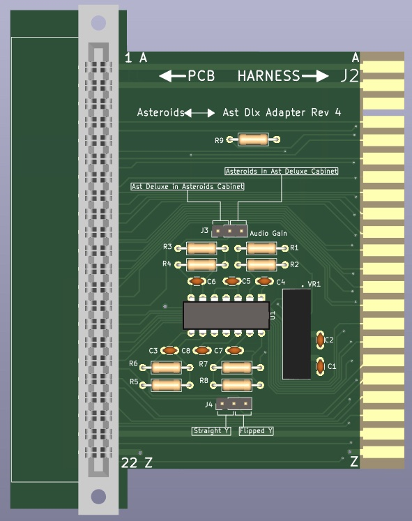

Asteroids PCB -> Asteroids Deluxe Cabinet (and vice versa) Adapter
==================================================================

Background
----------

It is occasionally desirable to use an Asteroids PCB in an Asteroids Deluxe
cabinet (or vice versa). For example, the Braze Asteroids Multigame adapter
offers some advantages over the Asteroids Deluxe version of the multigame, such
as more accurate sound, and a Lunar Lander thruster interface. Or one may want
to use an Asteroids cabinet for testing both Asteroids and Asteroids Deluxe
PCBs. Or one may prefer the aesthetics of one cabinet, but the gameplay of the
other PCB.

The Asteroids PCB is almost compatible with the Asteroids Deluxe cabinet (and
vice versa). There are a few differences that must be addressed for an Asteroids
PCB to properly work in an Asteroids Deluxe cabinet:

#. The Deluxe cabinet uses a mirror to produce a floating 3D effect, which has the
   side effect of inverting the image along the Y axis, so Asteroids Y output needs
   to be inverted to properly work on an Asteroids Deluxe cabinet.

#. The Y-axis flip is only true for full standup cabinets. An Asteroids in an
   Asteroids Deluxe Cabaret does not require a flip.

#. The audio amplifier board in the Asteroids Deluxe PCB (A/R 1 board) has a
   voltage gain of 1, while the amplifier in the original Asteroids cabinet (A/R
   board) has a voltage gain of 10. As a result, the Asteroids PCB audio output
   is 1/10 the amplitude of the Asteroids Deluxe PCB, and will be much to quiet.
   The Asteroids audio output needs to be amplified by a factor of 10 to sound
   right.

#. Several control inputs are swapped.  These are:

   - COINL (left coin switch) and START2 (2-player START)

   - COINC (center coin switch) and START1 (1-player START)

   - ROT L (Rotate Left) and ROT R (Rotate Right)

For using an Asteroids Deluxe PCB in an Asteroids cabinet, There is a slightly
different set of considerations:

#. The Asteroids cabinet does not ground the INV_Y input of the Asteroids Deluxe
   PCB, since the Asteroids PCB has no INV_Y input. Therefore, the Y output is
   not inverted, and does not need to be re-inverted by the cabinet.

#. The Astroids Deluxe audio output amplitude will be too large, and needs to be
   divided by 10 to sound correct in an Asteroids cabinet.

#. The control inputs need to be flipped the same as for an Asteroids PCB in an
   Asteroids Cabinet.

The Adapter
-----------

.. _production_package: https://github.com/dfnr2/asteroids-adapter/tree/main/production-package/

The adapter was created with KiCad 6.0.5. KiCad was used because it is freely
available and multi-platform. The adapter design files are in the top directory.
For those who wish to produce the PCB without installing KiCad, a ZIP file is
available in the production_package_ directory.

Assembly Notes
--------------

The PCB is designed to accomodate a variety of 44-pin edge connectors, so that almost any standard 0.156" connector will work.

- Vertical (straight) edge connectors (such as EDAC 305-044-521-202) can be
  sourced cheaply and are readily available. With a vertical connector, the
  adapter will be perpendicular to the Asteroids PCB.

- A Right-angle edge connector (such as EDAC 307-044-558-201) can be used to
  keep the adapter parallel and aligned the Asteroids PCB. These connectors are
  in production, but as far as I know are only available from EDAC, and could
  potentially be subject to supply chain issues.

Configuration
-------------

The asteroids adapter will accommodate either an Asteroids PCB in an Asteroids
Deluxe Cabinet, or an Asteroids Deluxe PCB in an Asteroids cabinet.

For Asteroids in a Deluxe cabinet, set the jumpers as follows:

- J3 (Audio gain): Asteroids in Ast Dlx Cabinet (10x gain)

- J4 (Y Flip): Flipped Y

For Asteroids Deluxe in an Asteroids cabinet, set the jumpers as follows:

- J3 (Audio gain): Ast Dlx in Asteroids Cabinet (0.1x gain)

- J4 (Y Flip): Straight Y

For Asteroids in an Asteroids Deluxe cabaret cabinet (not tested):

- J3 (Audio gain): Asteroids in Ast Dlx Cabinet (10x gain)

- J4 (Y Flip): Straight Y
